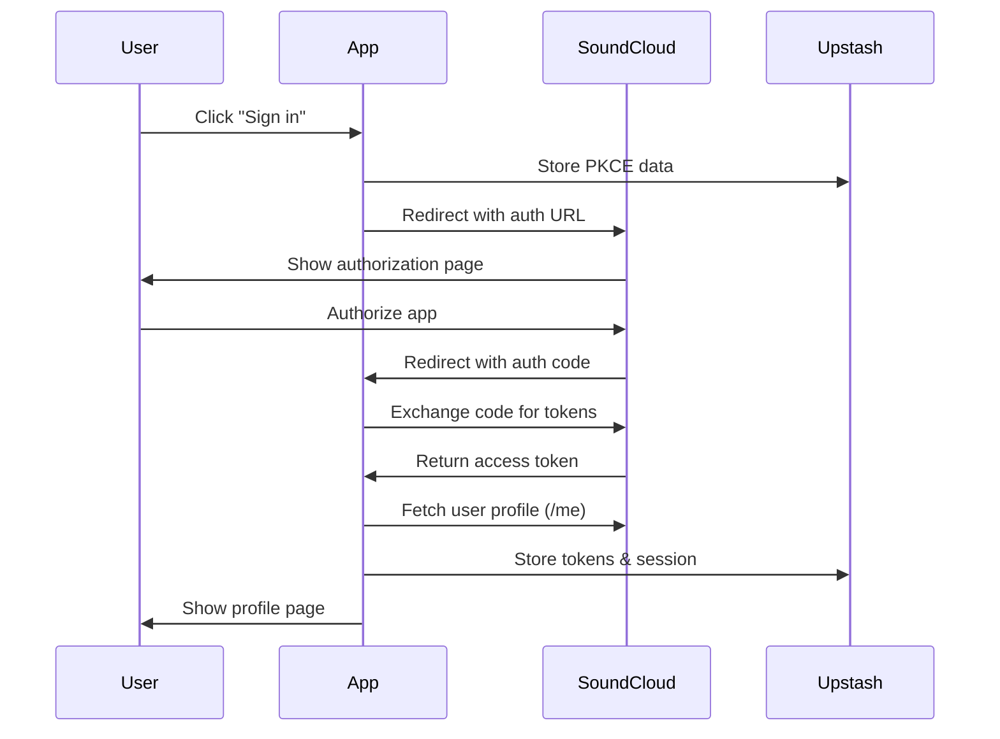

# 🎵 SoundCloud User Authentication App

A Next.js application that demonstrates secure SoundCloud OAuth 2.0 authentication with PKCE (Proof Key for Code Exchange). Users can sign in with their SoundCloud account, view their profile information, and make authenticated API requests to SoundCloud's API.

## ✨ Features

- **🔐 Secure OAuth 2.0 Authentication** with PKCE for enhanced security
- **🏪 Upstash KV Storage** for secure token and session management
- **👤 Comprehensive User Profile** with detailed stats, subscription info, and account data
- **🎵 Liked Tracks Display** with pagination, artwork, and track statistics
- **🔄 Automatic Token Refresh** to maintain authentication
- **📱 Responsive Design** with Tailwind CSS and modern UI components
- **⚡ Real-time Console Logging** of authenticated API responses
- **🛡️ CSRF Protection** with state parameter validation
- **🍪 Secure Session Management** with HTTP-only cookies
- **📊 Track Statistics** including plays, likes, duration, and unique artists
- **🎨 Rich Track Cards** with artwork, metadata, and social stats
- **🔗 Direct SoundCloud Links** to tracks and artist profiles

## 🚀 Quick Start

### Prerequisites

Before you begin, ensure you have:

- **Node.js** (version 16 or higher)
- **npm** or **pnpm** package manager
- A **SoundCloud Developer Account**
- An **Upstash Account** for KV storage

### 1. SoundCloud App Setup

1. Go to [SoundCloud Developers](https://soundcloud.com/you/apps)
2. Create a new app or select an existing one
3. In your soundcloud app settings, set the **Redirect URI** to:
   ```
   http://localhost:3000/login/success
   ```
   Ask the soundcloud support for two apps, one with your production endpoint (https://myapp.com/redirect_uri) and one with a local endpoint (http://localhost:3000/redirect_uri). This way, you can use the respective id and secret id so that the redirect uri can be tested locally.
4. Note down your **Client ID** and **Client Secret**

### 2. Upstash KV Setup

1. Create an account at [Upstash](https://upstash.com/)
2. Create a new **Redis database**
3. Go to your database details page
4. Copy the **REST URL** and **REST Token**

### 3. Environment Configuration

Create a `.env.local` file in your project root:

```env
# SoundCloud OAuth Configuration
SOUNDCLOUD_CLIENT_ID=your_soundcloud_client_id_here
SOUNDCLOUD_CLIENT_SECRET=your_soundcloud_client_secret_here
SOUNDCLOUD_REDIRECT_URI=http://localhost:3000/login/success

# Upstash KV Configuration
UPSTASH_REDIS_REST_URL=your_upstash_redis_rest_url_here
UPSTASH_REDIS_REST_TOKEN=your_upstash_redis_rest_token_here

# Next.js Configuration (optional)
NEXTAUTH_SECRET=your_random_secret_key_here
NEXTAUTH_URL=http://localhost:3000
```

### 4. Installation & Setup

1. **Clone the repository** (or download the files)
2. **Install dependencies:**
   ```bash
   npm install
   ```
3. **Start the development server:**
   ```bash
   npm run dev
   ```
4. **Open your browser** and navigate to `http://localhost:3000`

## 🔧 How to Use

### Step 1: Access the App
- Open `http://localhost:3000` in your browser
- You'll see the main page with a "Sign in with SoundCloud" button

### Step 2: Authentication
1. Click the **"Sign in with SoundCloud"** button
2. You'll be redirected to SoundCloud's authorization page
3. **Log in** with your SoundCloud credentials
4. **Authorize** the app to access your basic profile information
5. You'll be redirected back to the success page

### Step 3: View Your Dashboard
- After successful authentication, you'll see a tabbed interface with:

**Profile Tab:**
  - **Comprehensive user information** with avatar, display name, and online status
  - **Detailed statistics** including followers, following, tracks, likes, reposts
  - **Account information** like plan type, upload quota, and email verification
  - **Privacy settings** showing private tracks and playlists  
  - **Bio, location, and website** information
  - **Subscription details** if applicable

**Liked Tracks Tab:**
  - **Paginated list** of your liked tracks with artwork
  - **Track details** including title, artist, duration, and genre
  - **Social statistics** showing plays, likes, and comments for each track
  - **Aggregate statistics** for total plays, likes, duration, and unique artists
  - **Direct links** to tracks and artists on SoundCloud

### Step 4: Console Logging
- Check your browser's **Developer Console** or the **terminal** where you're running the app
- You'll see the authenticated API response from SoundCloud's `/me` endpoint

### Step 5: Logout
- Click the **"Logout"** button to end your session
- You'll be redirected back to the main page

## 🏗️ Technical Architecture

### Authentication Flow



### Key Security Features

- **PKCE (Proof Key for Code Exchange)**: Prevents authorization code interception attacks
- **State Parameter**: Protects against CSRF attacks
- **HTTP-only Cookies**: Secure session management
- **Token Encryption**: Tokens stored securely in Upstash KV
- **Automatic Refresh**: Tokens are automatically refreshed when expired

## 📁 Project Structure

```
src/
├── app/
│   ├── api/
│   │   ├── auth/
│   │   │   ├── soundcloud/route.ts      # Initiate OAuth flow
│   │   │   ├── exchange-token/route.ts  # Exchange code for tokens
│   │   │   └── logout/route.ts          # Handle logout
│   │   └── user/
│   │       ├── profile/route.ts         # Get comprehensive user profile
│   │       └── liked-tracks/route.ts    # Get user's liked tracks
│   ├── login/
│   │   └── success/page.tsx             # OAuth callback & dashboard
│   ├── globals.css                      # Global styles
│   ├── layout.tsx                       # Root layout
│   └── page.tsx                         # Main page
├── components/
│   ├── SoundCloudSignIn.tsx             # Sign-in button
│   ├── UserProfile.tsx                  # Basic user profile (legacy)
│   ├── UserProfileDetailed.tsx          # Comprehensive user profile
│   ├── LikedTracks.tsx                  # Liked tracks display with pagination
│   └── TrackCard.tsx                    # Individual track card component
├── lib/
│   ├── pkce.ts                          # PKCE utility functions
│   ├── soundcloud.ts                    # SoundCloud API service
│   ├── soundcloud-types.ts              # TypeScript interfaces
│   └── upstash.ts                       # Upstash KV service
└── public/
    └── music-placeholder.svg            # Placeholder for missing artwork
```

## 🔑 API Endpoints

| Endpoint | Method | Description |
|----------|--------|-------------|
| `/api/auth/soundcloud` | GET | Initiate OAuth flow |
| `/api/auth/exchange-token` | POST | Exchange auth code for tokens |
| `/api/user/profile` | GET | Get comprehensive user profile |
| `/api/user/liked-tracks` | GET | Get user's liked tracks with pagination |
| `/api/auth/logout` | POST | Logout and clear session |

## 🛠️ Available Scripts

- `npm run dev` - Start development server
- `npm run build` - Build for production
- `npm run start` - Start production server
- `npm run lint` - Run ESLint

## 🐛 Troubleshooting

### Common Issues

**1. "Failed to initiate authentication"**
- Check your `SOUNDCLOUD_CLIENT_ID` in `.env.local`
- Verify the redirect URI in your SoundCloud app matches exactly

**2. "Invalid redirect URI"**
- Ensure your SoundCloud app's redirect URI is set to: `http://localhost:3000/login/success`
- Check that `SOUNDCLOUD_REDIRECT_URI` in `.env.local` matches

**3. "Token exchange failed"**
- Verify your `SOUNDCLOUD_CLIENT_SECRET` in `.env.local`
- Check that your SoundCloud app is properly configured

**4. "Database connection failed"**
- Verify your Upstash `UPSTASH_REDIS_REST_URL` and `UPSTASH_REDIS_REST_TOKEN`
- Ensure your Upstash database is active

**5. "User profile not loading"**
- Check browser console for error messages
- Verify your access token is valid
- Ensure SoundCloud API is accessible

### Debug Mode

To enable debug logging, add to your `.env.local`:
```env
NODE_ENV=development
```

Then check the browser console and terminal for detailed logs.

## 📚 Dependencies

### Core Dependencies
- **Next.js 15.3.3** - React framework
- **React 19.0.0** - UI library
- **Tailwind CSS 4** - Styling framework
- **@upstash/redis** - KV storage client
- **uuid** - Session ID generation

### Development Dependencies
- **TypeScript** - Type safety
- **ESLint** - Code linting
- **@types/uuid** - TypeScript definitions

## 🔒 Security Best Practices

This app implements several security best practices:

1. **PKCE Flow**: More secure than standard OAuth flow
2. **State Validation**: Prevents CSRF attacks
3. **Secure Storage**: Tokens stored in encrypted KV store
4. **HTTP-only Cookies**: Session cookies not accessible via JavaScript
5. **Token Expiration**: Automatic token refresh and cleanup
6. **Environment Variables**: Sensitive data not in source code

## 🚀 Deployment

### Deploy to Vercel

1. Push your code to GitHub
2. Connect your repository to Vercel
3. Add environment variables in Vercel dashboard
4. Update redirect URI to your production domain
5. Deploy!

### Environment Variables for Production

Make sure to update your environment variables for production:

```env
SOUNDCLOUD_REDIRECT_URI=https://yourdomain.com/login/success
NEXTAUTH_URL=https://yourdomain.com
```

## 📄 License

This project is open source and available under the [MIT License](LICENSE).

## 🤝 Contributing

Contributions, issues, and feature requests are welcome! Feel free to check the [issues page](../../issues).

## 📞 Support

If you have any questions or need help setting up the app:

1. Check the troubleshooting section above
2. Review the SoundCloud API documentation
3. Check Upstash documentation for KV storage
4. Create an issue in this repository

---

**Happy coding! 🎉**
